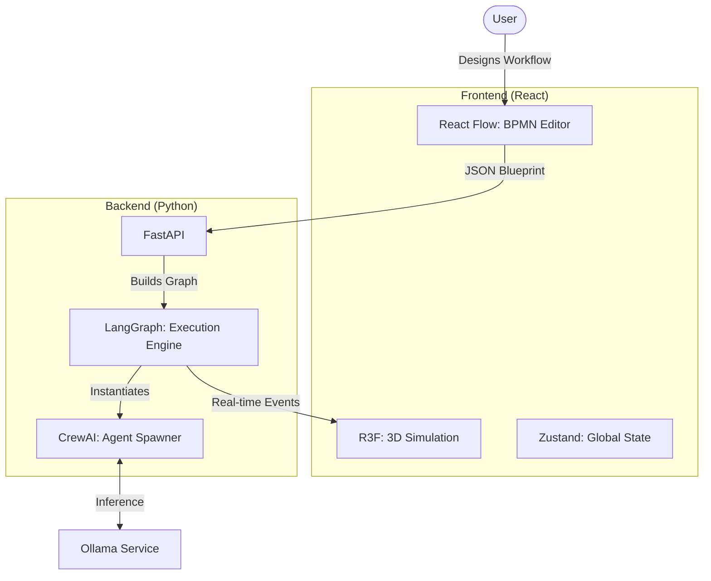

# 🏗️ Technical Architecture & Stack

This document details the technology choices, software architecture, and data flows for **NexusHQ**.

## 🔭 Overview

The project relies on a **decoupled client-server architecture** designed for modular workflow creation and 3D visualization.

* **Frontend:** A dual-mode SPA: **Blueprint Mode** (BPMN Editor) and **Simulation Mode** (3D Render).
* **Backend:** A dynamic graph engine capable of executing custom user-defined workflows.
* **AI Engine:** Pure local inference via Ollama.



---

## 🎨 1. Frontend (The Builder & Visualizer)

We use a split-view approach: **Design** (2D) and **Observe** (3D).

| Component | Technology | Role |
| --- | --- | --- |
| **BPMN Editor** | **React Flow** | The node-based interface to design workflows, drag & drop agents, and connect logic. |
| **3D Engine** | **React Three Fiber** | Visualizes the execution of the graph (Agents moving between nodes). |
| **State Manager** | **Zustand** | Syncs the 2D Graph structure (Blueprint) with the 3D Scene (Simulation). |
| **UI Overlay** | **TailwindCSS + Radix UI** | For the HUD, sidebars, and property inspectors. |

### Frontend Structure

```text
src/
├── editors/         # The 2D BPMN Interface
│   ├── Blueprint.jsx       # The React Flow Canvas
│   ├── nodes/              # Custom Nodes (AgentNode, RouterNode, ToolNode)
│   └── hooks/              # useGraphValidation.js
├── canvas/          # The 3D Simulation
│   ├── World.jsx           # The Building
│   └── AgentAvatar.jsx     # 3D Representation
└── stores/          # State
    └── useWorkflowStore.js # Holds the JSON Graph definition

```

---

## 🧠 2. Backend (The Dynamic Orchestrator)

The backend moves away from hardcoded flows to a **Dynamic Graph Architecture**.

| Component | Technology | Why this choice? |
| --- | --- | --- |
| **API Server** | **FastAPI** | Async support for WebSockets. |
| **Graph Engine** | **LangGraph** | Enables cyclic graphs (Loops), conditional edges (If/Else), and state persistence. |
| **Agent Core** | **CrewAI** | Used to define the *Personas* (Role, Goal, Backstory) injected into the graph nodes. |
| **LLM Connector** | **LangChain** | Standard interface for Ollama. |

### Backend Structure

```text
app/
├── core/
│   ├── graph_builder.py # Parses JSON -> LangGraph object
│   └── socket_manager.py
├── agents/          # Dynamic Agent Generator
│   └── factory.py   # Creates Agent() instances from JSON config
├── tools/           # Modular Skills
│   ├── design_tools.py # Image Gen, CSS Linter
│   └── dev_tools.py    # File I/O, Code Execution
└── main.py

```

---

## 💾 3. Data Protocol ( The Blueprint)

The communication between Frontend and Backend relies on a strict **JSON Schema** describing the BPMN graph.

**Example Payload (Workflow Definition):**

```json
{
  "workflow_id": "landing_page_gen",
  "nodes": [
    {
      "id": "node_1",
      "type": "agent",
      "data": {
        "role": "Designer",
        "goal": "Create a color palette",
        "model": "llama3",
        "tools": ["dalle_mock", "web_search"]
      }
    },
    {
      "id": "node_2",
      "type": "agent",
      "data": {
        "role": "Developer",
        "goal": "Write CSS variables",
        "model": "codellama"
      }
    }
  ],
  "edges": [
    { "source": "node_1", "target": "node_2", "type": "default" }
  ]
}

```

---

## 🤖 4. Artificial Intelligence (Local)

* **Inference:** Ollama (localhost:11434).
* **Dynamic Loading:** The backend pulls the model specified in the Node JSON (e.g., `codellama` for Dev nodes, `llama3` for PM nodes).

---

## 🔄 5. Execution Flow

1. **Design:** User draws nodes in React Flow.
2. **Compile:** Frontend converts the diagram to JSON and sends it to `POST /api/workflow/start`.
3. **Build:** Python iterates through the JSON nodes:
* For each "Agent Node", it instantiates a CrewAI Agent.
* For each "Link", it creates a LangGraph Edge.


4. **Run:** The graph executes.
* *Step 1:* Designer Agent runs -> WebSocket event `NODE_ACTIVE: node_1`.
* *Step 2:* 3D Avatar for Node 1 lights up.
* *Step 3:* Task completes -> Output passed to Node 2.


```

```
