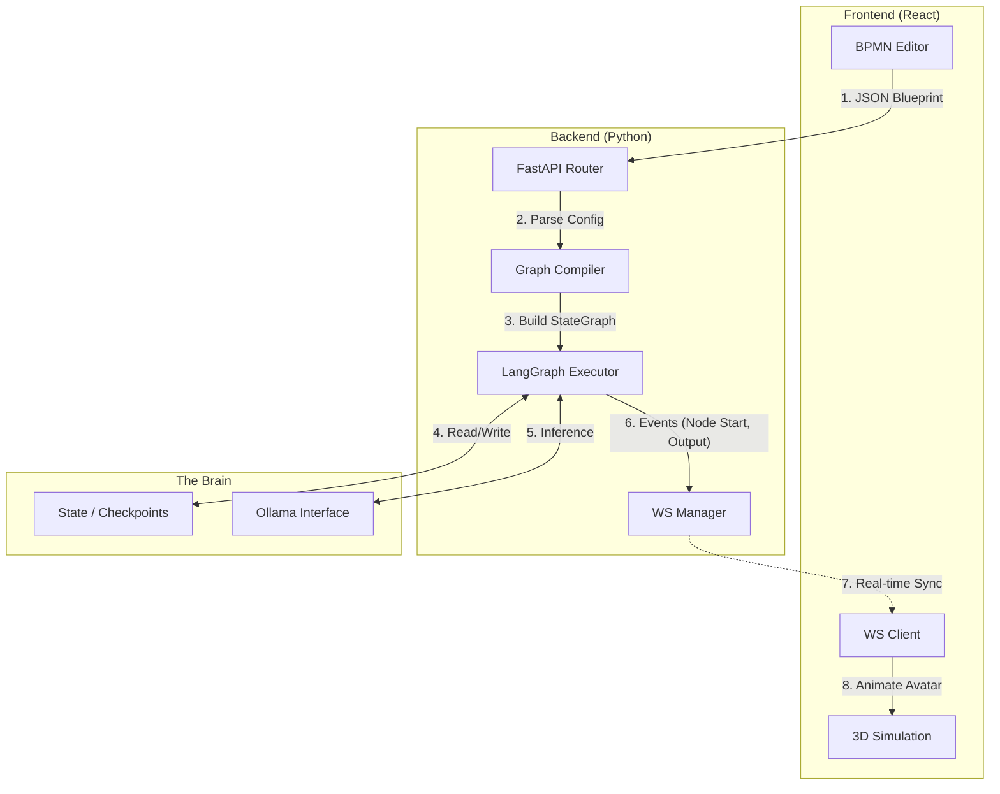

# 🏗️ NexusHQ Architecture

This document describes the internal engineering of NexusHQ.
The system is built on a **Decoupled Event-Driven Architecture**: the Frontend visualizes the state, while the Backend executes the graph logic.

---

## 🔭 High-Level Overview

We treat the AI workflow as a **State Graph**.
Instead of a linear script, the backend builds a directed cyclic graph (DAG) where nodes are Agents and edges are Logic (Conditionals).



---

## 🧠 Backend: The Dynamic Graph Engine

The core is no longer a static script. It is a **Graph Compiler**.

### 1. Technology Choice: LangGraph

We use LangGraph (built on LangChain) because it natively supports:

* **Cyclic Flows:** `Dev -> QA -> Dev` loops (impossible in standard DAGs).
* **Persistence:** Saving the state of the conversation at every step.
* **Human-in-the-loop:** Pausing execution to wait for user approval (UI Interaction).

### 2. The Compilation Process

When the user clicks "Run" in the UI, the Backend receives a JSON describing nodes and links. The `GraphCompiler` transforms this into executable Python code:

1. **Iterate Nodes:** For each node in JSON, create a `LangChain Agent` with specific tools.
2. **Iterate Edges:** Add connections using `workflow.add_edge(source, target)`.
3. **Handle Conditionals:** If a node has a "Router" or "Ralph Protocol" enabled, add a `conditional_edge`.

### 3. The "Ralph" Protocol (Validation Loop)

This is implemented as a **Conditional Edge** in LangGraph.

```python
# Pseudo-code logic in the Engine
def ralph_router(state):
    last_message = state['messages'][-1]
    if "APPROVED" in last_message.content:
        return "merge_node"
    else:
        return "developer_node" # <--- The Loop Back

workflow.add_conditional_edges(
    "qa_agent",
    ralph_router,
    {"merge_node": "github_merge", "developer_node": "developer"}
)

```

---

## 🎨 Frontend: The Dual View

The frontend manages two synchronized representations of the same data.

### 1. The Blueprint (React Flow)

* **Role:** Configuration & Logic Design.
* **Data:** Handles the `nodes` and `edges` state.
* **Inspector:** Manages the "RPG Stats" (Markdown context, Skin ID, Skills).

### 2. The Simulation (React Three Fiber)

* **Role:** Visualization & Feedback.
* **Logic:** It is **dumb**. It only reacts to WebSocket events.
* *Event:* `NODE_ACTIVE: { id: "agent_dev", action: "typing" }`
* *Reaction:* Find Avatar with ID "agent_dev" -> Play "Typing" Animation.


### 3. The Designer's Mockup View

* A specialized overlay that listens for `ARTIFACT_GENERATED` events.
* When the **Designer Agent** outputs HTML, this view renders it inside a sandboxed `<iframe>` for safety.

---

## 💾 Data Structures

### 1. The Graph Payload (JSON)

Sent from Frontend to Backend to start a run.

```json
{
  "graph_id": "project_alpha",
  "nodes": [
    {
      "id": "node_1",
      "type": "agent",
      "config": {
        "role": "Designer",
        "skin": "artist_01",
        "system_prompt": "You are a UI expert...",
        "skills": ["html_render"],
        "validation_required": true
      }
    },
    {
      "id": "node_2",
      "type": "agent",
      "config": {
        "role": "Developer",
        "skin": "coder_hoodie",
        "skills": ["python_repl", "github_push"]
      }
    }
  ],
  "edges": [
    { "source": "node_1", "target": "node_2" }
  ]
}

```

### 2. The WebSocket Events

Sent from Backend to Frontend during execution.

| Event Type | Payload | Frontend Action |
| --- | --- | --- |
| `GRAPH_START` | `{ run_id: "xyz" }` | Switch to 3D View, Lock Edit Mode. |
| `NODE_ENTER` | `{ node_id: "node_1" }` | Avatar "Thinking" animation. Camera Focus (Optional). |
| `TOOL_START` | `{ tool: "github", input: "..." }` | Show icon over Avatar head (e.g., Octocat icon). |
| `LOG_STREAM` | `{ content: "Writing code..." }` | Append text to HUD Console. |
| `ARTIFACT` | `{ type: "html", content: "..." }` | Open Mockup Preview Window. |
| `RALPH_REJECT` | `{ reason: "Syntax Error" }` | Flash Avatar Red. Play "Error" Sound. |

---

## 📂 File Structure (Monorepo)

```bash
nexushq/
├── frontend/                  # React Application
│   ├── src/
│   │   ├── components/
│   │   │   ├── Blueprint/     # React Flow Editor
│   │   │   ├── Simulation/    # R3F 3D Scene
│   │   │   └── Inspector/     # RPG Configuration Panel
│   │   └── stores/            # Zustand (Graph State + WebSocket)
│
├── backend/                   # Python Application
│   ├── app/
│   │   ├── compiler/          # JSON to LangGraph Builder
│   │   │   └── builder.py     # The magic happens here
│   │   ├── agents/            # Personas
│   │   │   └── personas.py    # Template for "Designer", "Dev", "PO"
│   │   ├── tools/             # Capabilities
│   │   │   ├── github.py      # PyGithub wrapper
│   │   │   └── filesystem.py  # Workspace I/O
│   │   └── engine/
│   │       └── runner.py      # LangGraph execution loop
│   ├── workspace/             # Local sandbox for agents
│   └── main.py                # FastAPI Entrypoint

```
