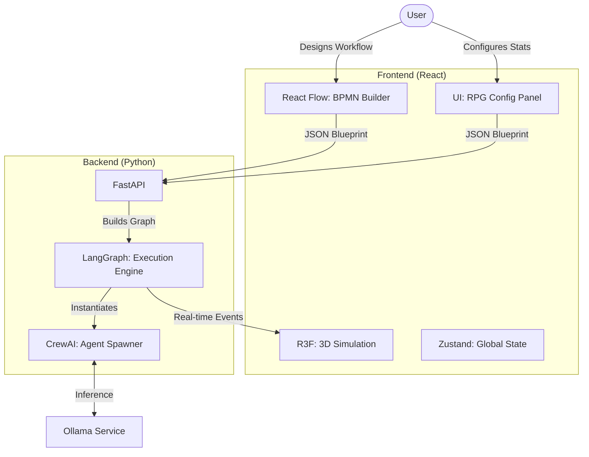

# 🏗️ Technical Architecture & Stack

This document details the technology choices, software architecture, and data flows for **NexusHQ**.

## 🔭 Overview

The project relies on a **decoupled client-server architecture** designed for modular workflow creation (BPMN) and 3D immersive visualization.

* **Frontend:** A dual-mode SPA: **Blueprint Mode** (React Flow Editor) and **Simulation Mode** (3D Render).
* **Backend:** A dynamic graph engine capable of executing custom, user-defined agent workflows on the fly.
* **AI Engine:** Pure local inference via Ollama.



---

## 🎨 1. Frontend (The Builder & Visualizer)

We use a split-view approach: **Design** (2D) and **Observe** (3D).

| Component | Technology | Role |
| --- | --- | --- |
| **BPMN Editor** | **React Flow** | The node-based interface to design workflows, drag & drop agents, and connect logic. |
| **Inspector UI** | **Radix UI** | The side-panel (Drawer) to configure Agent skins, Markdown context, and Skill Trees. |
| **3D Engine** | **React Three Fiber** | Visualizes the execution of the graph (Agents moving, typing, interacting). |
| **State Manager** | **Zustand** | Syncs the 2D Graph structure (Blueprint) with the 3D Scene (Simulation). |

### Frontend Structure

```text
src/
├── editors/         # The 2D BPMN Interface
│   ├── Blueprint.jsx       # The React Flow Canvas
│   ├── nodes/              # Custom Nodes (AgentNode, StartNode)
│   ├── inspector/          # The RPG Configuration Panel
│   │   ├── IdentityTab.jsx # Skin selector, Name
│   │   ├── BrainTab.jsx    # Markdown Editor (Monaco)
│   │   └── SkillsTab.jsx   # Hex Grid & Ralph Toggle
│   └── hooks/              # useGraphValidation.js
├── canvas/          # The 3D Simulation
│   ├── World.jsx           # The Building
│   └── AgentAvatar.jsx     # 3D Representation (Dynamic Skin)
└── stores/          # State
    └── useWorkflowStore.js # Holds the JSON Graph definition

```

---

## 🧠 2. Backend (The Dynamic Orchestrator)

The backend moves away from hardcoded flows to a **Dynamic Graph Architecture**. It acts as a factory that builds software teams on demand.

| Component | Technology | Why this choice? |
| --- | --- | --- |
| **API Server** | **FastAPI** | Async support for WebSockets. |
| **Graph Engine** | **LangGraph** | Enables cyclic graphs (Loops), conditional edges (If/Else), and state persistence. Crucial for the "Ralph Loop". |
| **Agent Core** | **CrewAI** | Used to define the *Personas* (Role, Goal, Backstory) injected into the graph nodes. |
| **LLM Connector** | **LangChain** | Standard interface for Ollama. |

### Backend Structure

```text
app/
├── core/
│   ├── graph_builder.py # Parses JSON -> LangGraph object
│   └── socket_manager.py
├── agents/              # Dynamic Agent Generator
│   └── factory.py       # Creates Agent() instances from JSON config
├── middleware/
│   └── ralph_protocol.py # Interceptor logic for validation loops
├── tools/               # Modular Skills
│   ├── design_tools.py  # Image Gen, CSS Linter
│   └── dev_tools.py     # File I/O, Code Execution
└── main.py

```

---

## 💾 3. Data Protocol (The Blueprint)

The communication between Frontend and Backend relies on a strict **JSON Schema**. This object describes the "RPG Stats" of every agent.

**Example Payload (Sent to Backend):**

```json
{
  "workflow_id": "custom_team_v1",
  "nodes": [
    {
      "id": "node_1",
      "type": "agent_persona",
      "config": {
        "identity": {
          "name": "Sarah",
          "role": "Lead Frontend",
          "skin_id": "cyberpunk_female_01" 
        },
        "brain": {
          "context_markdown": "## Directive\nYou are a React Expert. You strictly use Functional Components.",
          "temperature": 0.7
        },
        "skills": {
          "capabilities": ["web_search", "write_file", "generate_image"],
          "ralph_validation_enabled": true 
        }
      }
    }
  ],
  "edges": [
    { "source": "start", "target": "node_1" }
  ]
}

```

---

## 🤖 4. Artificial Intelligence (Local)

* **Inference:** Ollama (localhost:11434).
* **Dynamic Loading:** The backend parses the `config.skills` list to decide which model to load (e.g., if "Python" skill is selected -> load `codellama`, otherwise `llama3`).

---

## 🔄 5. Execution Flow

1. **Design:** User draws nodes in React Flow.
2. **Configure:** User clicks a node, opens Inspector, selects "Robot Skin", writes Markdown prompt, and toggles "Ralph Validation".
3. **Compile:** Frontend converts the diagram to the JSON Payload above.
4. **Build:** Python iterates through the JSON:
* *Factory:* Spawns a CrewAI Agent with the Markdown as `backstory`.
* *Ralph Check:* If `ralph_validation_enabled` is true, creates a subgraph with a QA Validator.


5. **Run:** The graph executes.
* *Step 1:* Agent runs.
* *Step 2:* WebSocket sends `NODE_ACTIVE` event.
* *Step 3:* 3D Avatar plays animation based on `skin_id`.


```

```
